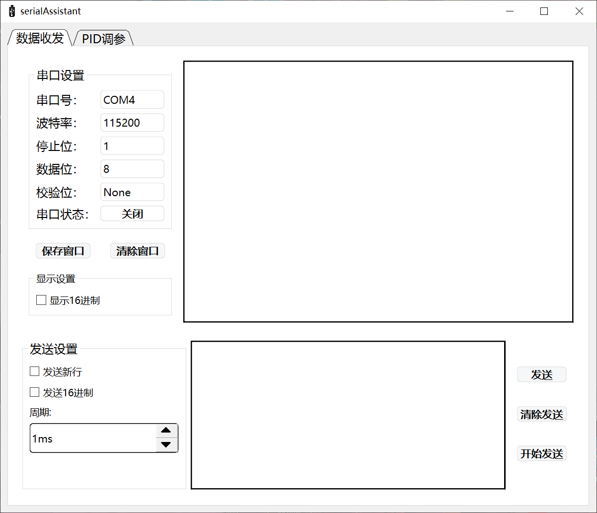
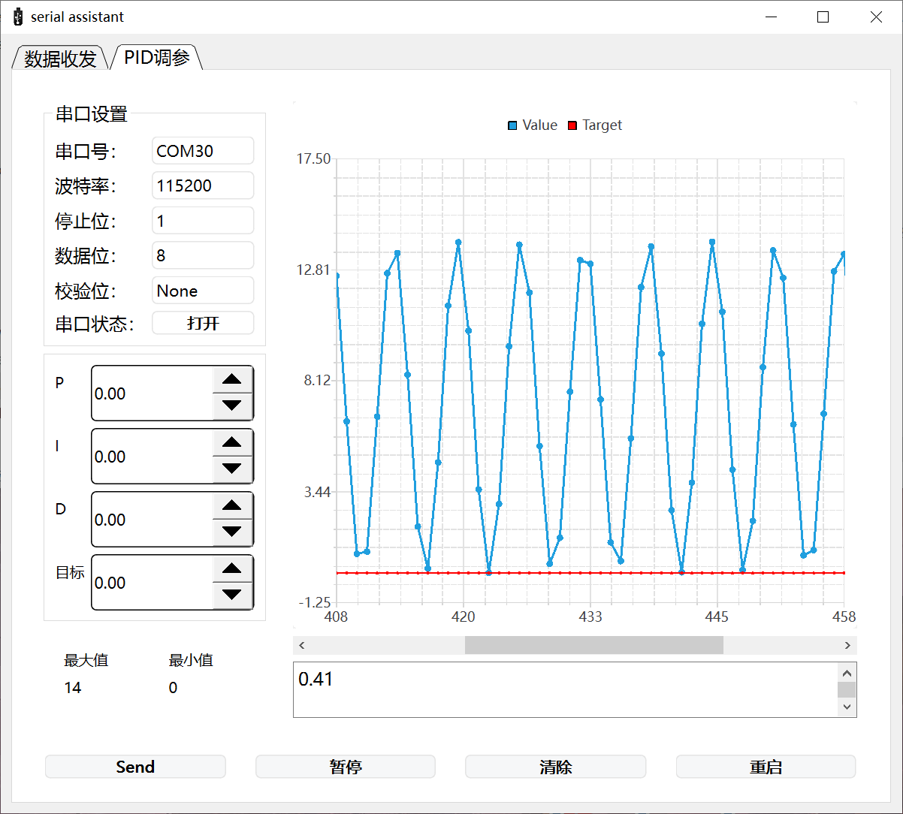
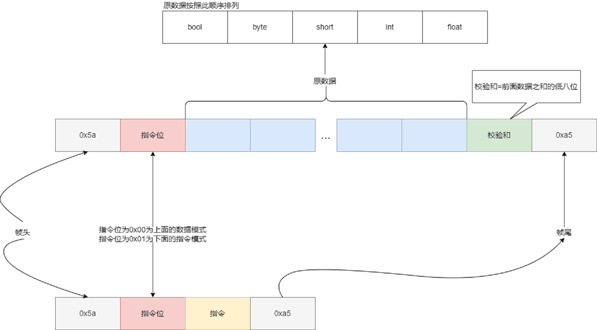

# serialAssistant

`serialAssistant`是我利用寒假完成的一个小作品，算是我**Qt**学习的毕业作品。我**C++、Qt**都是从寒假开始学起，**QSS**压根没学，所以界面有些瑕疵，请多多包涵。 如果发现bug， 请尽快提`issue`:love_letter:。二更于2.24。

## 介绍

1.数据收发界面

2.PID调参界面

这是`serialAssisant`的两个界面。

其中**数据收发**界面基本上集成了串口的主要功能。

而**PID调参**界面是我看到野火的串口助手加的，应该会有用吧。

PID调参收发数据有一个通信协议，比野火的那个简单，但也差不多（基本上是**蓝牙调试器APP**协议的魔改版）。这个协议后面会介绍。

后面也许会加个串口示波器的功能。

如果有什么好的创意，请多多分享。

## 如何使用

[下载](https://github.com/fazhehy/serialAssistant/releases/tag/v1.1.0)`zip`后解压直接运行``serialAssisant.exe``即可。

`code`文件夹有源代码，可以在此基础上改进`serialAssisant`。

> ps 代码基本上没注释，相信你能看懂。

> 我是用`clion`写的`Qt`程序。利用`minGW、cmake`编译源码。目前只支持windows。

## 协议说明

这是协议的数据帧格式，协议大致也就这些内容了。

我写了一个serial类，实现了这个协议。有机会我会提交一个适用单片机的类文件(clion开发stm32用c++，模仿稚晖大佬)

`PID调参`将接收单片机的两个`float`数据，分别是`value`、`target`。

会发出四个`float`数据，分别是`target`、`P`、`I`、`D`。

在按下功能键之后也会发送一些指令。如下

> 0x01 重启
>
> 0x02 暂停
>
> 0x03 重新开始

> 再按下发送键之后，先会发送数据，然后发送重启指令。
>
> 之后我会提交一个单片机的example

## 关于pid调试界面的一些操作

- 单击表格会，停止滚动。
- 停止滚动后，可拖动滚动条。
- 停止滚动后，可按**ctrl+中键**缩放y轴。

## 一些快捷键

1.数据收发界面

- enter 直接发送
- ctrl+s 保存窗口

2.pid调试界面

- enter 直接发送

