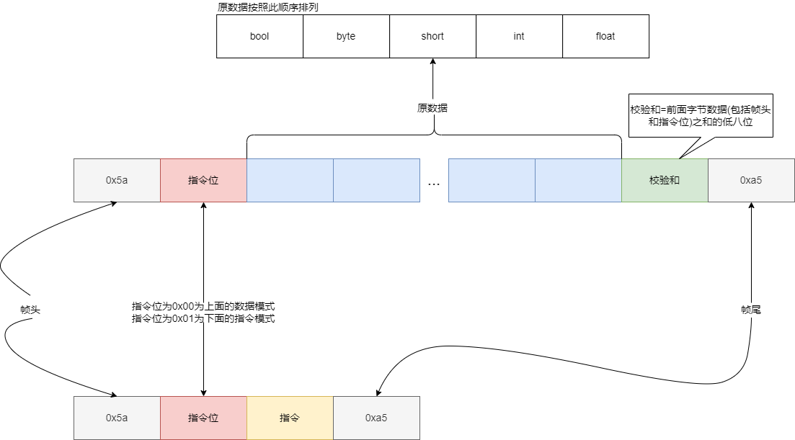

# serialAssistant

serialAssistant是我利用寒假完成的一个小作品，算是我**Qt**学习的毕业作品:joy:。我**C++、Qt**都是从寒假开始学起，**QSS**压根没学，所以界面有些瑕疵，请多多包涵:see_no_evil::stuck_out_tongue_winking_eye:。 如果发现bug， 请尽快提交:love_letter:。

## 介绍

这是serialAssisant的两个界面。

其中**数据收发**界面基本上集成了串口的主要功能。

而**PID调参**界面是我看到野火的串口助手加的，应该会有用吧。

PID调参收发数据有一个通信协议，比野火的那个简单，但也差不多（基本上是蓝牙调试器APP协议的魔改版）。这个协议后面会介绍。

后面也许会加个串口示波器的功能。

如果有什么好的创意，请多多分享。

## 如何使用

项目有个文件夹`` release``, 直接运行``serialAssisant.exe``即可。

`code`文件夹有源代码，可以在此基础上改进`serialAssisant`。

> ps 代码基本上没注释，相信你能看懂:stuck_out_tongue_closed_eyes:。

> 我是用`clion`开发的`Qt`。如果没配置环境的，网上有教程。

## 协议说明

这是协议的数据帧格式，协议大致也就这些内容了。

我写了一个serial类，实现了这个协议。有机会我会提交一个适用单片机的类文件(clion开发stm32用c++，模仿稚晖大佬的:eyes:)
